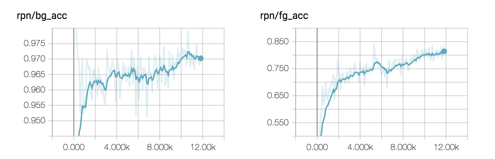
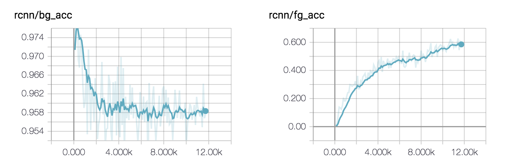
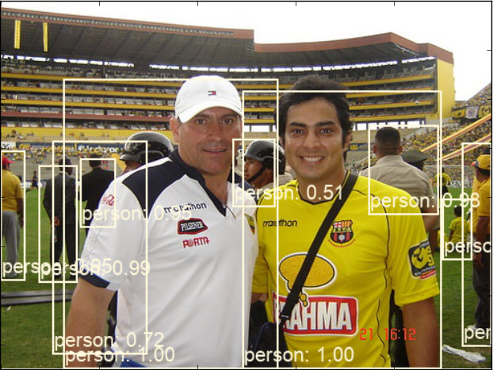
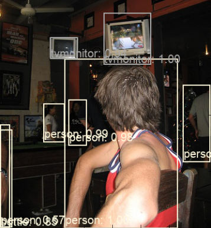

# Faster-RCNN Pytorch Implementaton

## Prerequisites

- python 3.5.x
- pytorch 0.4.1
- tensorboardX
- opencv3
- pillow
- easydict
- matplotlib
- 
## Purpose

- [x] Training and testing on VOC
- [ ] VGG16
- [x] ResNet-50
- [ ] ResNet-101

## Main Results

| | training set | test set | network| mAP@600 |
| :--: | :--: | :--: | :--: |:--: |
|this repo|VOC2007|VOC2007|res50|69.1|
|original paper|VOC2007|VOC2007|res50|-|

## Visualization

You can inspect the accuray of both foreground and background samples in RPN and RCNN 

 

## Detection Results

## Preparation

1. First clone the code

        git clone https://github.com/tztztztztz/faster-rcnn.pytorch.git
    
2. Install dependencies
	
        cd $PROJECT
        pip install -r requirements.txt
	
3. Compile `roi_pooling layer` and `gpu_nms`
    
        cd $PROJECT/faster-rcnn
        sh make.sh

## Training on PASCAL VOC

### Prepare the data

Please follow the instructions of this [repository](https://github.com/tztztztztz/yolov2.pytorch.git) to prepare the data

### Download the pretrained model on ImageNet

Get the model [Google Drive](https://drive.google.com/open?id=0B7fNdx_jAqhtbllXbWxMVEdZclE), and put it at `$PROJECT/data/pretrained` folder. See more detail at [ruotian/pytorch-resent](https://github.com/ruotianluo/pytorch-resnet)

### Train
    python train.py --cuda
    
## Evaluation

    python test.py --cuda
    
you can check the detection results with command below

    python test.py --cuda --vis
    

    

